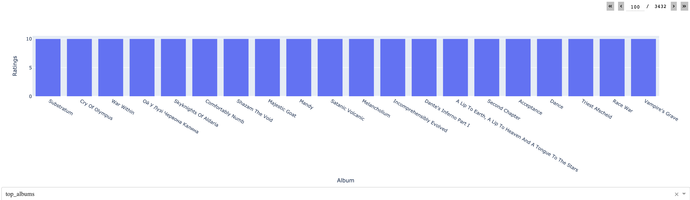

# Music-styles-popularity

##Table of contents

- [General info](#general-info)
- [Technologies](#technologies)
- [Screenshots](#screenshots)

##General info
The aim of the project is to analyze the popularity of types of metal music due to the popularity of individual bands existing between 1960 and 2023. The topic I want to implement is directly related to my interests in metal music, which is manifested both by listening to it and playing the electric guitar. Data which will be used to complete the project will be obtained from the website https://metalstorm.net/home/.

##Technologies
Project is created with:

- Python
- ChromeDriver 114.0.5735.90
- Pandas
- Selenium
- Statsmodel
- Dash
- Numpy

##Screnshots

A chart showing the popularity of a selected musical style

A chart showing popularity of all music styles through years 1960 - 2023

A chart showing top 20 albums on page metalstorm.com

A chart showing top 20 bands on page metalstorm.com

